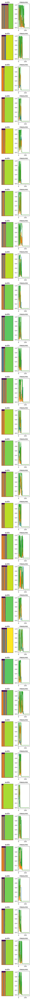

# ml-template
Template for my machine learning projects. 

It's quite opinionated in the following (and probably more) ways:
- uses accelerate
- splits up config, model and scripts
- assumes one is always using a huggingface dataset (this can also be done using ``load_dataset('some_dataset.py')``)
- uses collators as the main way to process data that hasn't been preprocessed by the dataset
- uses separate configs for training (everything not shipped with the model), model and collator

## architecture
The following updates automatically every time one of the training scripts is run.

## BURN (Boston University Radio News)

Click to expand

</img>

## RAVDESS (Ryerson Audio-Visual Database of Emotional Speech and Song)

Click to expand

</img>

## TIMIT (Acoustic-Phonetic Continuous Speech Corpus)

Click to expand

</img>

## first training batch

Click to expand

</img>

