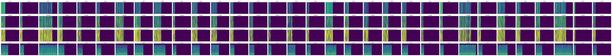

# Masked Prosody Modeling - Evaluation

This repository contains the evaluation code for the paper **TBD** (link to paper).
For the Masked Prosody Modeling code, see **TBD** (link to code).

## architecture
The following updates automatically every time one of the training scripts is run.

## BURN (Boston University Radio News)

Click to expand

</img>

## RAVDESS (Ryerson Audio-Visual Database of Emotional Speech and Song)

Click to expand

</img>

## TIMIT (Acoustic-Phonetic Continuous Speech Corpus)

Click to expand

</img>

## first training batch

Click to expand

</img>

